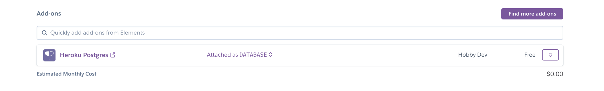
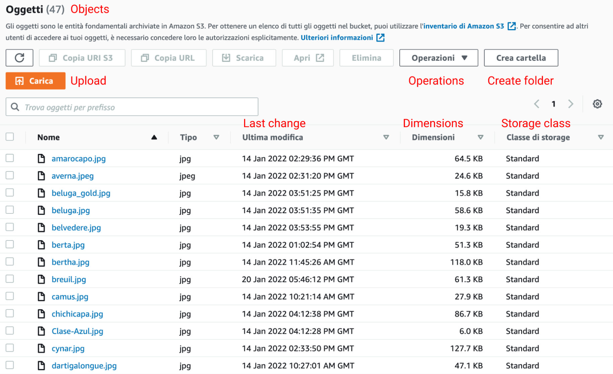

# Fine Spirits Shop

<h1 align="center">Fine Spirits :cocktail: | Milestone :four: Project </h1>

### [View live project here](https://fine-spirits.herokuapp.com/)
### [View the testing information here - (TESTING.md) ](TESTING.md)

## Overview

Fine Spirits shop is an ecommerce website allowing users to purchase bottles. It has been developed as milestone project 4 as part of the Code Institute - Diploma in Software Development (Full stack) course.
The website is designed to be responsive and accessible on all devices; being at the same time simple but pleasant.

---

## Table of Contents

1. [UX](#ux)
- [User Stories](#user-stories)
- [User Centered Design](#user-centered-design)
  - [Strategy](#strategy)
    - [User needs](#user-needs)
  - [Scope](#scope)
  - [Structure](#structure)
  - [Skeleton and Wireframes](#Skeleton-and-Wireframes)

2. [DESIGN](#design)
- [Color scheme](#color-scheme)
- [Typography](#typography)
- [Imagery](#imagery)
- [Logo](#logo)

3. [DATABASE MODEL](#database-model)
- [Database model features](#database-model-features)

4. [FEATURES](#features)
- [Design Features](#design-features)
- [Admin Feature](#Admin-Feature)
- [Features left to implement](#features-left-to-implement)

5. [TECHNOLOGIES USED](#technologies-used)
- [Syntax](#syntax)
- [Frameworks, Libraries & Programs](#frameworks-libraries-&-programs)

6. [TESTING](#testing)
- [Testing document](TESTING.md)

7. [API](#api)
- [Stripe](#stripe)

8. [DEPLOYMENT](#deployment)
- [Heroku and Postgres DB](#Heroku-and-Postgres-DB)
- [Amazon Web Services](#amazon-web-services)
- [Github](#github)
  - [Forking the repository](#forking-the-repository)
  - [Creating a Clone](#creating-a-clone)

9. [CREDITS](#credits)

10. [REFERENCES](#references)

11. [ACKNOWLEDGEMENTS](#acknowledgements)

## UX

### **User stories**

 #### As an anonymous user/ first time visitor I want to:
  1. Be able to easily navigate throughout the site to visualise content and contacts.
  2. Check out a specific bottle, visualise the relative details and price.
  3. Purchase a bottle.
  4. Locate their social media links to see their followings on social media in order to be updated about their latest releases.

 #### As a registered user/frequent visitor I want to (in addition to the anonymous user functionalities):
  5. Be able to log in.
  6. Be able to log out.
  7. Be able to delete my account.
  8. Be able to add personal details.
  9. Be able to update personal details.
  10. Be able view my order history.

 #### As the admin I want to:
  11. Be able to add products to the site.
  12. Be able to update product details.
  13. Be able to delete products from the site. 
  14. Have unique access to all features.

  #### As the website owner I want to:
  15. Make the website as accessible and responsive as possible.
  16. Gain a better understanding of the audience by checking their feedback both via the social networks.
  17. Use reviews to increase customer satisfaction.
  18. Find the best way to allow communication bewteen customers and the organization.

---

## USER CENTERED DESIGN

### **Strategy**

- #### User needs

The main goal of this website is to increase more and more the popularity of the shop in order to increase sales too.
Registered users will be able to see their previous orders, their current ones and get discounts as the registration is treated like a loyalty card membership.
The website will show a bright palette as well as minimalistic but aesthetically pleasing imagery to invite users to check out the products.

- **Demographic:**
  - 18 + years of age.
  - Anyone who is interested in spirits.
  - Anyone who would like to purchase a bottle as a present for a friend.

The steps a new user would ideally take when landing onto the website are the following:
  - Explore the websites landing page, where the information will explain the user the reason to be of the site.
  - Create a new account.
  - Explore the additional features available to registered users.
  - Purchase the desired bottle.
  - Get the feedback of the purchase.
  - Log in/out to check the progress.
  - Check out the links in the footer.

The website needs to enable the **User** to:
  - Easy access the features of the website.
  - Register and log in if further interested.
  - Get in touch with the website owner and/or admin.
  - Give feedback.

The website needs to enable the **Website owner and/or admin** to:
  - Develop an online presence .
  - Provide an easily navigable website for users.
  - Improve the website thanks to the contacts.

This will all be achieved through creating a clear and strong UI focusing on well structured content. Having a clear hierarchy will allow the user to navigate and use the functionality of the website without the need of instructions. Simplicity and UX friendly functionality will be the strongholds of the whole project. 

---

### **Scope**

- **Features within the design plan with highest priority:**
  - Minimal but functional and appealing homepage .
  - Navigation links clearly visible on the top of the website.
  - Responsive navigation bar.
  - Only allow registered users to create and manage their own accounts.
  - Only allow registered users to check out their previous orders.
  - Only allow registered users to delete their account.

- **Lower priority features that may not be included in the initial release of the website:**
  - The ability for logged in users to search the website database.
  - Search bar on the navigation bar so the users have fast access to their researches.
  - Contact section to send an email to the Admin directly from the website.

---

### Structure

The information architecture was organized in a fluid and clear way in order to ensure that users could navigate through the site with ease and efficiency.

---

### Skeleton and Wireframes
Wireframe mockups were created in Figma Workspace [Click here for final wireframes](readme_files/wireframes).
The mobile view is intentionally made disproportionate to show how the full page might look on a mobile screen.
Several style changes were made in the final project compared to the inital wireframe on [Figma](https://www.figma.com/ "Link to Figma page"). Those changes were mainly related to colours, font size, positioning on the page; all aimed at providing the best user experience and responsiveness.

---

## DESIGN

The design of the website was created to be as simple and harmonious as possible, not to distract the user with too many color schemes and trying to bring the focus onto the game itself.

### **Color scheme**

The colours used in this project are presented on a light background, to keep a minimalistic and tidy website, as well as keeping the color contrast the highest possible to facilitate the screen readers and make this site accessible to all. In addition to that there are also some brighter features thought specifically to draw the attention of the user to the main parts.
 
Please check out the colour Colour palette.
 

Colour palette

    
 

---

### **Typography**

- The selected font for the whole project is [Poppins](https://fonts.google.com/specimen/Poppins) with [Sans-Serif](https://en.wikipedia.org/wiki/Sans-serif) as the fallback font in case, for any reason, the font will not be imported into the site correctly.

---

### **Imagery**

- For this specific project imagery has been kept very minimalist in order to concentrate the work on the functionality of the app. Images have been selected from [Unsplash](https://unsplash.com/ "Link to Unsplash page").
- Other images come from my personal archive.

---

### **Logo**

- The favicon was created using [Favicon.io](https://favicon.io/favicon-converter/) and the logo used to create it was created using an online application called [Freelogodesign](https://it.freelogodesign.org/). It represents a simple glass/botle with the "Fine Spirits" words.
 

Logo

    
 

---

## Database Model

### Database model features

- The website is a data-centric one with html, javascript, css used with the bootstrap (version 5) framework as a frontend
- The backend consists of Python built with the Django framework with a database of a Postgres for the deployed Heroku version (production).
- [Postgres](https://www.postgresql.org/) is a powerful, open source object-relational database system.
- [SQLLite](https://www.sqlite.org/index.html) database was used for local development. 

- This model contains all fields stored in the database collections with their data type and mimics the structure of what is actually stored in the Postgres database.

---

## Features

The website has the following features based on:

1. A user not logged into the site
2. A regular user logged into the site
3. An admin user
The navigation buttons update depending on whether a user is logged in or not, and whether that user is the admin:

 Nav Link              |Not logged in  |Logged in as regular user|Logged in as admin
:-------------         |:------------- |:----------------|:------------- |
Home     |&#9989;        |&#9989;          |&#9989; |
Products           |&#9989;        |&#9989;          |&#9989; |
Product Detail           |&#9989;        |&#9989;          |&#9989; |
Products Detail (Review)          |&#10060;        |&#9989;          |&#9989; |
Product Management(Add Product)     |&#10060;       |&#10060;         |&#9989; |
Product Management(Edit Product)     |&#10060;       |&#10060;         |&#9989; |
Product Management(Delete Product)     |&#10060;       |&#10060;         |&#9989; |
Favourites     |&#10060;       |&#9989;         |&#9989; |
Add to Favourites     |&#10060;       |&#9989;        |&#9989; |
My Profile             |&#10060;       |&#9989;          |&#9989; |
Order History         |&#10060;       |&#9989;          |&#9989; |
Log out               |&#10060;       |&#9989;          |&#9989; |
Register               |&#9989;        |&#10060;         |&#10060; |
Log in               |&#9989;        |&#10060;         |&#10060; |
News                |&#9989;        |&#9989;         |&#9989; |
News Item             |&#9989;        |&#9989;        |&#9989; |
News Item (comment) |&#10060;        |&#9989;          |&#9989; |
Bag |&#9989;        |&#9989;          |&#9989; |
Checkout |&#9989;        |&#9989;          |&#9989; |
Checkout success |&#9989;        |&#9989;          |&#9989; |

 

### Admin Feature
There are a number of admin views that have been configured at https://fine-spirits.herokuapp.com/admin; They give excellent CRUD operations to the data in the Postgres database as well as search and filter options. They are as follows:
- Categories

- Products

- Sites

- Users

 

### Design Features
Each page of the website features a consistent responsive navigational system:

 

#### Header
- The **Header** contains a conventionally placed **logo** at the top left of the page (clicking this will redirect users back to the home page) and **navigation bar** at the top right of the page. Hovering over the buttons in the navbar will trigger hover effect.
<ul>
    <li><strong>User stories covered by this feature:</strong>  
    </li>
    <li><strong>1</strong> - Be able to easily navigate throughout the site to visualise content and contacts.
    </li>
    <li><strong>2</strong> - Check out a specific bottle, visualise the relative details and price.
    </li>
    <li><strong>5</strong> - Be able to log in.
    </li>
    <li><strong>6</strong> - Be able to log out.
    </li>
    <li><strong>15</strong> - Make the website as accessible and responsive as possible.
    </li>
</ul>
  

Header

    
  

 

#### Navigation bar on smaller devices
- On smaller screens, the two main buttons (Play and Login) reduce their size in a responsive way and self position at the top right next to the registration one.
<ul>
    <li><strong>User stories covered by this feature:</strong>  
    </li>
    <li><strong>1</strong> - Be able to easily navigate throughout the site to visualise content and contacts.
    </li>
    <li><strong>2</strong> - Check out a specific bottle, visualise the relative details and price.
    </li>
    <li><strong>15</strong> - Make the website as accessible and responsive as possible.
    </li>
</ul>
  

Navbar on small devices

    
  

 

#### Footer
- The **Footer** contains the appropriate **social media icons**, linking users to the main social media pages of the shop.
<ul>
    <li><strong>User stories covered by this feature:</strong>  
    </li>
    <li><strong>1</strong> - Be able to easily navigate throughout the site to visualise content and contacts.
    </li>
    <li><strong>4</strong> - Locate their social media links to see their followings on social media in order to be updated about their latest releases.
    </li>
    <li><strong>15</strong> - Make the website as accessible and responsive as possible.
    </li>
    <li><strong>16</strong> - Gain a better understanding of the audience by checking their feedback both via the social networks.
    </li>
    <li><strong>17</strong> - Use reviews to increase customer satisfaction.
    </li>
</ul>
  

Footer

    
  

 

#### Mailto
- In the footer, there is a **Mailto** embedded in the email. Hovering over the email will trigger hover effect.
<ul>
    <li><strong>User stories covered by this feature:</strong>  
    </li>
    <li><strong>1</strong> - Be able to easily navigate throughout the site to visualise content and contacts.
    </li>
    <li><strong>18</strong> - Find the best way to allow communication bewteen customers and the organization.
    </li>
</ul>
  

Mailto

    
  

 

#### Search Button 
- In the top right corner of every page, there is a **Search Button** . The customer can enter directly the name of the product he/she interested to purchase or the kind of spirit (e.g. Gin). This improves the UX experience.
<ul>
    <li><strong>User stories covered by this feature:</strong>  
    </li>
    <li><strong>1</strong> - Be able to easily navigate throughout the site to visualise content and contacts.
    </li>
    <li><strong>2</strong> - Check out a specific bottle, visualise the relative details and price.
    </li>
    <li><strong>15</strong> - Make the website as accessible and responsive as possible.
    </li>
</ul>
  

Search Button

    
  

 

#### Back to the top button
- **Back to the top button**  - This <strong>button</strong> :arrow_up: is present in the footer so that the user can comfortably click them to be redirected to the top of the page. This feature improves the quality of navigation, especially if using smartphones.
<ul>
    <li><strong>User stories covered by this feature:</strong>  
    </li>
    <li><strong>1</strong> - Be able to easily navigate throughout the site to visualise content and contacts.
    </li>
    <li><strong>15</strong> - Make the website as accessible and responsive as possible.
    </li>
</ul>
  

Btn back to the top

    
  

 

<dl>
  <dt><a href="home.html" target="_blank" alt="Quiz game Home Page">Home Page</a></dt>
     <ul>
        <li><strong>User stories covered by this feature:</strong>  
        </li>
        <li><strong>1</strong> - Be able to easily navigate throughout the site to visualise content and contacts.
        </li>
        <li><strong>4</strong> - Locate their social media links to see their followings on social media in order to be updated about their latest releases.
        </li>
        <li><strong>15</strong> - Make the website as accessible and responsive as possible.
        </li>
        <li><strong>16</strong> - Gain a better understanding of the audience bv checking their feedback both via the social networks
        </li>
        <li><strong>17</strong> - Use reviews to increase customer satistaction.
        </li>
        <li><strong>18</strong> - Fino the best wav to allow communication bewteen customers and the organization.
        </li>
     </ul>

  <dd>The Home Page consists of the following elements:
     <ul>
          <li><strong>Page</strong> - x
          </li>
          <li><strong>Page</strong> - x
          </li>
     </ul>
        

Home

        
        

  </dd>

   

  <dt><a href="login.html" target="_blank" alt="login Page">Login page</a></dt>
     <ul>
         <li><strong>User stories covered by this feature:</strong>  
      </li>
          <li><strong>5</strong> - Be able to log in.
      </li>
          <li><strong>6</strong> - Be able to log out.
      </li>
          <li><strong>7</strong> - Be able to delete my account.
      </li>
          <li><strong>11</strong> - Be able to add products to the site (if admin).
      </li>
          <li><strong>12</strong> - Be able to update product details (if admin).
      </li>
      </li>
          <li><strong>13</strong> - Be able to delete products from the site (if admin).
      </li>
      </li>
          <li><strong>14</strong> - Have unique access to all features (if admin).
      </li>
      </li>
          <li><strong>15</strong> - Make the website as accessible and responsive as possible
      </li>
     </ul>

  <dd>The Login page consists of the following elements:
     <ul>
          <li><strong>Login</strong> - x
          </li>
          <li><strong>Anonymous user</strong> - Allows the user who does not want to register to keep checking anyway by clicking on the appropriate button. The ideal situation would be to have as many registered users as possible but it is always good to allow choice to those who do not want to register.
          </li>
          <li><strong>Registration</strong> - It opens the registration page.
          </li>
     </ul>
         

Login

         
         

  </dd>

   

  <dt><a href="registration.html" target="_blank" alt="registration Page">Registration Page</a></dt>
     <ul>
         <li><strong>User stories covered by this feature:</strong>  
      </li>
          <li><strong>7</strong> - Be able to delete my account.
      </li>
          <li><strong>8</strong> - Be able to add personal details.
      </li>
          <li><strong>9</strong> - Be able to update personal details.
      </li>
          <li><strong>10</strong> - Be able view my order history.
      </li>
          <li><strong>15</strong> - Make the website as accessible and responsive as possible
      </li>
     </ul>

  <dd>The Registration page consists of the following elements:
     <ul>
          <li><strong>Username</strong> - x
          </li>
          <li><strong>Password</strong> - x
          </li>
          <li><strong>Repeat Password</strong> - x
          </li>
          <li><strong>Create Account</strong> - x
          </li>
     </ul>
         

Registration

         
         

  </dd>

   

  <dt><a href="bag.html" target="_blank" alt="Bag">Bag</a></dt>
     <ul>
         <li><strong>User stories covered by this feature:</strong>  
      </li>
         <li><strong>2</strong> - Check out a specific bottle, visualise the relative details and price.
      </li>
          <li><strong>3</strong> - Purchase a bottle.
      </li>
          <li><strong>15</strong> - Make the website as accessible and responsive as possible
     </ul>

  <dd>The bag page consists of the following elements:
     <ul>
          <li><strong>x</strong> - x
          </li>
          <li><strong>x</strong> - x
          </li>
          <li><strong>x</strong> - x
          </li>
          <li><strong></strong> - x
          </li>
     </ul>
         

Bag

         
         

  </dd>

   

  <dt><a href="products.html" target="_blank" alt="Products Page">Products Page</a></dt>
     <ul>
         <li><strong>User stories covered by this feature:</strong>  
      </li>
          <li><strong>1</strong> - Be able to easily navigate throughout the site to visualise content and contacts.
      </li>
          <li><strong>2</strong> - Check out a specific bottle, visualise the relative details and price.
      </li>
          <li><strong>15</strong> - Make the website as accessible and responsive as possible.
      </li>
     </ul>

  <dd>The Products page consists of the following elements:
     <ul>
          <li><strong>Username</strong> - x
          </li>
          <li><strong>Password</strong> - x
          </li>
          <li><strong>Repeat Password</strong> - x
          </li>
          <li><strong>Create Account</strong> - x
          </li>
     </ul>
         

Products

         
         

  </dd>

   

  <dt><a href="product_detail.html" target="_blank" alt="Product detail">Product Detail</a></dt>
     <ul>
         <li><strong>User stories covered by this feature:</strong>  
      </li>
          <li><strong>2</strong> - Check out a specific bottle, visualise the relative details and price.
      </li>
          <li><strong>15</strong> - 15. Make the website as accessible and responsive as possible.
      </li>
     </ul>

  <dd>The Product Detail page consists of the following elements:
     <ul>
          <li><strong>x</strong> - x
          </li>
          <li><strong>x</strong> - x
          </li>
          <li><strong>x</strong> - x
          </li>
          <li><strong>x</strong> - x
          </li>
     </ul>
         

Product Detail

         
         

  </dd>

   

  <dt><a href="404.html" target="_blank" alt="404 Page">404 Page</a></dt>
     <ul>
         <li><strong>User stories covered by this feature:</strong>  
      </li>
          <li><strong>1</strong> - Be able to easily navigate throughout the site to visualise content and contacts.
      </li>
          <li><strong>15</strong> - Make the website as accessible and responsive as possible
      </li>
     </ul>

  <dd>The 404 page consists of the following elements:
     <ul>
          <li><strong>Line 1</strong> - It shows that the user is on page 404.
          </li>
          <li><strong>Line 2</strong> - Standard line for a page 404, inviting the user to click on the links to go back to a page of the website.
          </li>
     </ul>
         

404

         
         

  </dd>
  </dl>

   

### Features left to implement

- Improved searching and filtering on the products page.
- The functionality to add and display multiple images on each product.
- API like EmailJS to facilitate communication between customers and shop owner.
- Downloading and implementing a Py currency package that would allow purchases in other currencies.
- A FAQ page.
- Login with social media accounts.
- A live chat to improve the UX experience.
- Implementing other payment systems like Paypal.

---

## TECHNOLOGIES USED

### **Syntax**

- [HTML5](https://en.wikipedia.org/wiki/HTML5)
- [CSS](https://en.wikipedia.org/wiki/CSS)
- [Markdown](https://www.markdownguide.org/basic-syntax/)
- [JavaScript](https://en.wikipedia.org/wiki/JavaScript)
- [JQuery](https://jquery.com/)
- [Python](https://en.wikipedia.org/wiki/Python_(programming_language))

---

### Frameworks, Libraries & Programs

- [Figma:](https://www.figma.com/login)
  - Figma was used to create the [wireframes](put link to wireframes) during the design process.

- [Font Awesome](https://fontawesome.com/)
  - Used to include icons.

- [Google Fonts](https://fonts.google.com/)
  - Used to import the three fonts used throughout the site xxxxxxxx.

- [GitHub](https://github.com/)
  - Used to host the entire repository for the project.

- [GitPod](https://www.gitpod.io/)
  - The code editor used to build the entire project.

- [TinyPNG](https://tinypng.com/)
  - Used this to compress the images used on the website to make files smaller.

- [Favicon](https://favicon.io/)
  - Used to generate the websites favicon logo of various sizes for different devices.

- [W3C Validator HTML](https://validator.w3.org/)
  - Validator for HTML.

- [W3C Validator CSS](https://jigsaw.w3.org/css-validator/)
  - Validator for CSS.

- [JSHint](https://jshint.com/)
  - This is a tool used to detect errors or potential problems within Javascript code, used to test and validate all Javascript written for this project.

- [Pylint](https://www.pylint.org/)
  - Pylint is a source-code, bug and quality checker for the Python programming language.

- [Django](https://www.djangoproject.com/)
  - Django is a high-level Python web framework that encourages rapid development and clean, pragmatic design.

- [Heroku](https://id.heroku.com/login)
  - Heroku is a cloud platform as a service (PaaS) supporting several programming languages.
  - The Heroku network runs the customer's apps in virtual containers which execute on a reliable runtime environment.

- [BrowserStack](https://www.browserstack.com/)
  - Test the functionality and appearance of the project on all main browsers.

- [W3Schools](https://www.w3schools.com/)
  - To check demos and explanations.

- [Stack overflow](https://stackoverflow.com/)
  - To find answers to most common problems.

- [Lambda Test](https://www.lambdatest.com/)
  - For cross-browser testing among the major browsers.

- [Postgres Db](https://www.postgresql.org/)
  - PostgreSQL is a powerful, open source object-relational database system.

---

## Testing
Testing information can be found in a separate testing :information_source: [file](TESTING.md "Link to testing file")

---

## API

### Stripe
To set up Stripe, proceed as follows:

1. Register for an account at stripe.com
2. Click on the Developers section of your account once logged in.
3. Under Developers, click on the API keys section.

4. Note the values for the publishable and secret keys
5. In your local environment(env.py) and heroku, create environment variables STRIPE_PUBLIC_KEY and STRIPE_SECRET_KEY with the publishable and secret key values
 <code>os.environ.setdefault('STRIPE_PUBLIC_KEY', 'YOUR_VALUE_GOES_HERE')</code>
 <code>os.environ.setdefault('STRIPE_SECRET_KEY', 'YOUR_VALUE_GOES_HERE')</code>

6. Back in the Developers section of your stripe account click on Webhooks
7. Create a webhook with the url of your website <url>/checkout/wh/, for example: https://dashboard.heroku.com/apps/fine-spirits/checkout/wh/
8. Select the payment_intent.payment_failed and payment_intent.succeeded as events to send

9. Note the key created for this webhook
10. In your local environment(env.py) and heroku, create environment variable STRIPE_WH_SECRET with the secret values
<code>os.environ.setdefault('STRIPE_WH_SECRET', 'YOUR_VALUE_GOES_HERE')</code>

11. Feel free to test out the webhook and note the success/fail attempts for troubleshooting
---

## Deployment

### Heroku and Postgres DB
To deploy this application to Heroku, run the following steps:

1. Create an account at heroku.com
2. Create an app, give it a name (for example fine-spirits), and select a region.
3. Under resources search for postgres, and add a Postgres database to the app.

    
4. Note the DATABASE_URL, this can be set as an environment variable in Heroku and your local deployment(env.py)
5. Install the plugins dj-database-url and psycopg2-binary.
6. Run pip3 freeze > requirements.txt so both are added to the requirements.txt file
7. Create a Procfile with the text: web: gunicorn fine_spirits.wsgi:application for example.
8. In the settings.py ensure the connection is to the Heroku postgres database.
9. Ensure debug is set to false in the settings.py file.
10. Add localhost and fine-spirits.herokuapp.com to the ALLOWED_HOSTS variable in settings.py.
11. Run "python3 manage.py showmigrations" to check the status of the migrations.
12. Run "python3 manage.py migrate" to migrate the database.
13. Run "python3 manage.py createsuperuser" to create a super/admin user.
14. Install gunicorn and add it to the requirements.tx file using the command pip3 freeze > requirements.txt
15. From the CLI login to Heroku using the command heroku git:remote -a fine-spirits
16. Disable collectstatic in Heroku before any code is pushed using the command heroku config:set DISABLE_COLLECTSTATIC=1 -a fine-spirits
17. Push the code to Heroku using the command git push heroku master.
18. Ensure the following environment variables are set in Heroku.

19. Connect the app to GitHub, and enable automatic deploys from main

    
20. Click deploy to deploy your application to Heroku for the first time
21. Click on the link provided to access the application
22. If you encounter any issues accessing the build logs is a good way to troubleshoot the issue

### Amazon Web Services
To set up AWS S3 Bucket, proceed as follows:

1. Create an account at aws.amazon.com
2. Open the S3 application and create an S3 bucket named "fine-spirits".
3. Uncheck the "Block All Public access setting".
4. In the Properties section, navigate to the "Static Website Hosting" section and click edit.
5. Enable the setting, and set the index.html and the error.html values.

6. In the Permissions section, click edit on the CORS configuration and set the below configuration.

7. In the permissions section, click edit on the bucket policy and generate and set the below configuration(or similar to your settings).

8. In the permissions section, click edit on the Access control list(ACL).
9. Set Read access for the Bucket ACL for Everyone (Public Access).
10. The bucket is created, the next step is to open the IAM application to set up access.
11. Create a new user group named "add_group_name".
12. Add the "AmazonS3FullAccess" policy permission for the user group.

13. Go to "Policies" and click "Create New Policy"
14. Click "Import Managed Policy" and select "AmazonS3FullAccess" > Click 'Import'.
15. In the JSON editor, update the policy "Resource" to the following:

 <code>"Resource": [</code>
 <code>"arn:aws:s3:::add_fine-spirits",</code>
 <code>"arn:aws:s3:::add_fine-spirits/*"</code>
 <code>]</code>

16. Give the policy a name and click "Create Policy".
17. Add the newly created policy to the user group.
18. Go to Users and create a new user
19. Add the user to the user group "add_group_name"
20. Select "Programmatic access" for the access type
21. Note the AWS_SECRET_ACCESS_KEY and AWS_ACCESS_KEY_ID variables, they are used in other parts of this README for local deployment and Heroku setup.
22. The user is now created with the correct user group and policy.
23. Note the AWS code in settings.py. Note an environment variable called USE_AWS must be set to use these settings, otherwise it will use local storage.

24. These settings set up a cache policy, set the bucket name, and the environment variables AWS_ACCESS_KEY_ID and AWS_SECRET_ACCESS_KEY that you set in your aws account.
25. The configuration also requires the media/static folders that must be setup in the AWS S3 bucket to store the media and static files.
26. AWS S3 Stored images.

27. AWS S3 Stored static files.

### Github

#### Forking the Repository
By forking the GitHub Repository a copy of the original repository is made on the GitHub account. To view and/or to make  changes without affecting the original repository: 
1. Log into [GitHub](https://github.com/login "Link to GitHub login page") or [create an account](https://github.com/join "Link to GitHub create account page").
2. Locate the [GitHub Repository](https://github.com/FrankN88/fine-spirits "Link to GitHub Repo").
3. At the top of the repository, on the right side of the page, select "Fork".
4. You should now have a copy of the original repository in your GitHub account.

#### Creating a Clone
How to run this project locally:
1. Install the [GitPod Browser](https://www.gitpod.io/docs/browser-extension/ "Link to Gitpod Browser extension download") Extension for Chrome.
2. After installation, restart the browser.
3. Log into [GitHub](https://github.com/login/ "Link to GitHub login page") or [create an account](https://github.com/join "Link to GitHub create account page").
4. Locate the [GitHub Repository](https://github.com/FrankN88/fine-spirits "Link to GitHub Repo").
5. Click the green "GitPod" button in the top right corner of the repository.
This will trigger a new gitPod workspace to be created from the code in github where you can work locally. 
Click [Here](https://help.github.com/en/github/creating-cloning-and-archiving-repositories/cloning-a-repository#cloning-a-repository-to-github-desktop) to retrieve pictures for some of the buttons and more detailed explanations of the above process

---

## CREDITS

### Content
- Stack Overflow for guidance
- Psychological properties of text colour in the README.md was found [here](http://www.colour-affects.co.uk/psychological-properties-of-colours)
- [Bootstrap](https://getbootstrap.com/ "Link to BootStrap page") for the Boostrap features.

### Media
- Some images come from my personal archive.
- All the other Images were downloaded from [Unsplash](https://unsplash.com/ "Link to Unsplash page").

### Code
The developer consulted multiple sites in order to better understand the code that they were trying to implement. The following sites were used on a more regular basis:
- [Stack Overflow](https://stackoverflow.com/ "Link to Stack Overflow page")
- [W3Schools](https://www.w3schools.com/ "Link to W3Schools page")
- [Bootstrap](https://getbootstrap.com/ "Link to BootStrap page")
- [MDN Web Docs](https://developer.mozilla.org/en-US/ "Link to MDN Web Docs")
- [jQuery](https://jquery.com/ "Link to jQuery page")
- [Django](https://www.djangoproject.com/ "Link to Django project page")
- [Python](https://www.python.org/ "Link to Python page")

### Acknowledgements
- My mentor Mo Shami for continuous helpful feedback.
- Tutor support at Code Institute for their support.
- My family for opinions and feedback.

***

---

