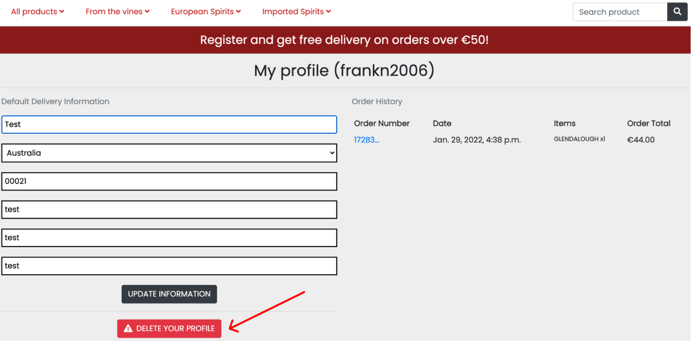
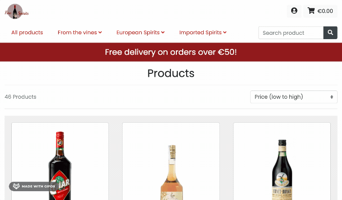
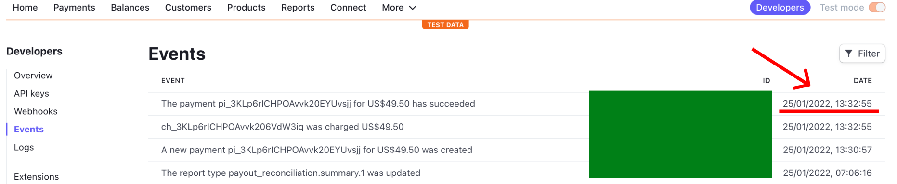
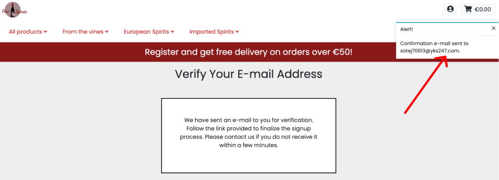

<h1 align="center">Fine Spirits :cocktail: | Milestone :four: Project </h1>

### [View live project here](https://fine-spirits.herokuapp.com/)

### [Main README.md file](/README.md) ###

### Testing User Stories from User Experience (UX) Section

-   #### Anonymous user/ First time visitor Goals:

    1. Be able to easily navigate throughout the site to visualise content and contacts.

        1. Upon entering the site, users are automatically greeted with a clean and easily readable sticky navigation bar to go to the page(s) of the desired product.
           

Evidence

           
           

        2. The button "Visit the shop" will take the user to the page with all products. Otherwise the user who knows exacly what to buy can put the name in the search box (e.g. "Dingle Gin") or select the spirit family (e.g "frome the vines --> Grappa --> Nardini)
           

Evidence

           
           

        3. At the bottom of the page there is a footer with the links to the social networks and contacts. 
           

Evidence

           
           

    2. Check out a specific bottle, visualise the relative details and price.

        1. The user, when selecting a specific bottle, will have the chance to check all of the details of the product. 
           

Evidence

           
           

    3. Purchase a bottle.

        1. After selecting the bottle and the desired quantity, the user will add it to the bag and proceed to check out.
           

Evidence

           
           

        2. The user will add his/her details.
           

Evidence

           
           

        3. The user will complete the order.
           

Evidence

           
           

    4. Locate their social media links to see their followings on social media in order to be updated about their latest releases.

        1. At the bottom of the page there is a footer with the links to the social networks and email.
           

Evidence

           
           

-   #### Registered user/ returning/ frequent visitor goals

    5. Be able to log in.

        1. At the top right corner of the page the user will be able to log in by clicking on the first icon.
           

Evidence

           
           

    6. Be able to log out.

        1. Once in, the user will easily be able to log out.
           

Evidence

           
           

    7. Be able to delete my account.

        1. The user will be able to delete the account by clicking on the specific button. A message will warn you before confirming the action.
           

Evidence

           
           

    8. Be able to add personal details.

        1. The user will add his/her personal details when registering to the page.
           

           
           

    9. Be able to update personal details.

        1. The user will be able to edit his/her personal details if necessary.
           

Evidence

           
           

    
    10. Be able view my order history.

        1. Only the logged in user will be able to check the history of his/her orders. The order will position in chronological order in the right part of the page as in the image below.
           

Evidence

           
           

       

-   #### Admin Goals

    11. Be able to add products to the site (CRUD funcionality).

        1. Only the admin can add products to the site.
           

Evidence

           
           

    12. Be able to update product details (CRUD funcionality).

        1. Only the admin can edit products to the site.
           

Evidence

           
           

    13. Be able to delete products from the site (CRUD funcionality). 

        1. Only the admin can delete products to the site.
           

Evidence

           
           

        2. Only the admin can delete products to the site - action.
           

Evidence

           
           

    14. Have unique access to all features.

        1. Changes can be made only by logging in with admin credentials.
           

Evidence

           
           

-   #### Site Owner Goals, Testing

     15. Make the website as accessible and responsive as possible.

         1. The website is responsive on any device and is designed according to the most important UX principles - Please check responsiveness testing below.
           

Evidence

           
           

     16. Gain a better understanding of the audience by checking their feedback both via the social networks.

         1. Access (via na external link) to the social netorks in present in the footer of each page.
           

Evidence

           
           

     17. Use reviews to increase customer satisfaction.

         1. The social networks and email can help with feedback.
           

Evidence

           
           

     18. Find the best way to allow communication bewteen customer and the organization.

         1. The social networks and email will improve communication between the user and the organization.
           

Evidence

           
           

## User testing 
Friends and family members were asked to review the site and documentation to point out any feedback and possible way of improving it. Their helpful advice throughout the process led to many UX changes in order to create a better experience, especially regarding the styling. 

It was through this testing that the following changes were made:
- Assessing the combinations of colours and the related contrast.
- Fonts choice looking smart and not invasive.
- Overall balance in the positioning and sizing of elements in the pages.

## Manual Testing  :wrench:

### Common Elements Testing
Manual testing was conducted on the following pages in order to assess responsiveness,functionality and usability:

- Hovering over the Navbar will trigger `hover` effect.
  

Navbar hover

    
  

- Hovering over Social links will trigger `hover` effect and clicking on them will open a new tab. 
  

Hover and open new tab

    
  

- Clicking on the logo will take you back to the home page or refresh it.
  

Click logo to return to home page

    
  

- Hovering over the email in the footer will trigger `hover` effect and clicking on them will redirect you to the email (mailto).
  

Mailto

    
  

- Clicking on the  `Back to the top` button will bring the user back to the top of the page.
  

Back to the top button

    
  

- Typing a specific product or type of spirit in the `Search box` will show exaclty what the user is looking for.
  

Search box

    
  

### Home Page
Manual testing was conducted on the following elements of the [Home Page](index.html):

 - All the elements are responsive (header, footer, carousel).
 - The buttons in the Navbar turns into smaller buttons ordered in the same way.
   

Home Page

    
  

 
### Login Page
Manual testing was conducted on the following elements of the [Login Page](login.html):

 - All the elements are responsive (header, footer, central window).
 - The buttons in the Navbar turns into smaller buttons ordered in the same way.
   

Login page

    
  

### Registration Page
Manual testing was conducted on the following elements of the [Registration Page](registration.html):

 - All the elements are responsive (header, footer, central window).
 - The buttons in the Navbar turns into smaller buttons ordered in the same way.
   

Registration page

    
  

### Bag
Manual testing was conducted on the following elements of the [Bag Page](bag.html):

 - All the elements are responsive (header, footer, text, image).
 - The buttons in the Navbar turns into smaller buttons ordered in the same way.
   

Bag Page

    
   

### Products page
Manual testing was conducted on the following elements of the [Products Page](products.html):

 - All the elements are responsive (header, footer, text).
 - The buttons in the Navbar turns into smaller buttons ordered in the same way.
   

Products Page

    
   

### Product detail
Manual testing was conducted on the following elements of the [Product Detail](product_detail.html):

 - All the elements are responsive (header, footer, text, cards).
 - The buttons in the Navbar turns into smaller buttons ordered in the same way.
   

Product detail Page

    
   

### Profile
Manual testing was conducted on the following elements of the [Profile Page](profile.html):

 - All the elements are responsive (header, footer, text, form, buttons).
 - The buttons in the Navbar turns into smaller buttons ordered in the same way.
   

Profile Page

    
   

 

## Automated Testing  :wrench:

### Code Validation
- The [W3C Markup Validator](https://validator.w3.org/) service was used to validate the `HTML` code used. Where not possible to validate by URI i have used the source code.

Page | Result | Test Detail/Screenshot
------------ | ------------- | -------------
home.html | Passed, No errors found | [Results](readme_files/testing/validators/html/home.jpg)
login.html | Passed, No errors found | [Results](readme_files/testing/validators/html/login.jpg)
registration.html | Passed, No errors found | [Results](readme_files/testing/validators/html/registration.jpg)
bag.html | Passed, No errors found | [Results](readme_files/testing/validators/html/bag.jpg)
add_product.html | Passed, No errors found | [Results](readme_files/testing/validators/html/add_product.jpg)
edit_product.html | Passed, No errors found | [Results](readme_files/testing/validators/html/edit_product.jpg)
products.html | Passed, No errors found | [Results](readme_files/testing/validators/html/products.jpg)
product_detail.html | Passed, No errors found | [Results](readme_files/testing/validators/html/product_detail.jpg)
profile.html | Passed, No errors found | [Results](readme_files/testing/validators/html/profile.png)

 

### CSS Validation Service
- The [W3C CSS Validator](https://jigsaw.w3.org/css-validator/) service was used to validate the `CSS` code used.

Page | Result | Test Detail/Screenshot
------------ | ------------- | -------------
style.css | Passed, No errors found | [Results](readme_files/testing/validators/css/style_css.png)
profile.css | Passed, No errors found | [Results](readme_files/testing/validators/css/profile_css.png)
checkout.css | Passed, No errors found | [Results](readme_files/testing/validators/css/checkout_css.png)
checkout_success.css | Passed, No errors found | [Results](readme_files/testing/validators/css/checkout_success_css.png)

 

### JSHint
- The [JS Hint](https://jshint.com/) service was used to validate the `JS` code used.

Page | Result | Test Detail/Screenshot
------------ | ------------- | -------------
countryfield.js | 0 errors | [Results](readme_files/testing/validators/js/countryfield_js.png)
script.js | 0 errors | [Results](readme_files/testing/validators/js/script_js.png)
stripe_elements.js | 0 errors | [Results](readme_files/testing/validators/js/stripe_elements_js.png)

 

### PEP8 Online Check
- [PEP8 Online](http://pep8online.com/) was used to analyse the `PYTHON` file.
- The files that have not been used (e.g home/admin.py etc) have not been analysed as empty and not relevant to this specific project.

Page | Result | Test Detail/Screenshot
------------ | ------------- | -------------
fine_spirits/settings.py | 0 errors | [Results](readme_files/testing/validators/pep8/fine_spirits/fine_spirits_setting.png)
fine_spirits/urls.py | 0 errors | [Results](readme_files/testing/validators/pep8/fine_spirits/fine_spirits:urls.png)
bag/apps.py | 0 errors | [Results](readme_files/testing/validators/pep8/bag/bag_apps.png)
bag/contexts.py | 0 errors | [Results](readme_files/testing/validators/pep8/bag/bag_contexts.png)
bag/urls.py | 0 errors | [Results](readme_files/testing/validators/pep8/bag/bag_urls.png)
bag/views.py | 0 errors | [Results](readme_files/testing/validators/pep8/bag/bag_views.png)
checkout/admin.py | 0 errors | [Results](readme_files/testing/validators/pep8/checkout/checkout_admin.png)
checkout/apps.py | 0 errors | [Results](readme_files/testing/validators/pep8/checkout/checkout_apps.png)
checkout/forms.py | 0 errors | [Results](readme_files/testing/validators/pep8/checkout/checkout_forms.png)
checkout/models.py | 0 errors | [Results](readme_files/testing/validators/pep8/checkout/checkout_models.png)
checkout/signals.py | 0 errors | [Results](readme_files/testing/validators/pep8/checkout/checkout_signals.png)
checkout/urls.py | 0 errors | [Results](readme_files/testing/validators/pep8/checkout/checkout_urls.png)
checkout/webook_handler.py | 0 errors | [Results](readme_files/testing/validators/pep8/checkout/checkout_webhook_handler.png)
checkout/webhooks.py | 0 errors | [Results](readme_files/testing/validators/pep8/checkout/checkout_webhooks.png)
home/apps.py | 0 errors | [Results](readme_files/testing/validators/pep8/home/home_apps.png)
home/urls.py | 0 errors | [Results](readme_files/testing/validators/pep8/home/home_urls.png)
home/views.py | 0 errors | [Results](readme_files/testing/validators/pep8/home/home_views.png)
products_admin.py | 0 errors | [Results](readme_files/testing/validators/pep8/products/products_admin.png)
products_apps.py | 0 errors | [Results](readme_files/testing/validators/pep8/products/products_apps.png)
products_forms.py | 0 errors | [Results](readme_files/testing/validators/pep8/products/products_forms.png)
products_models.py | 0 errors | [Results](readme_files/testing/validators/pep8/products/products_models.png)
products_urls.py | 0 errors | [Results](readme_files/testing/validators/pep8/products/products_urls.png)
products_views.py | 0 errors | [Results](readme_files/testing/validators/pep8/products/products_views.png)
products_widget.py | 0 errors | [Results](readme_files/testing/validators/pep8/products/products_widget.png)
profiles/apps.py | 0 errors | [Results](readme_files/testing/validators/pep8/profiles/profiles_apps.png)
profile/forms.py | 0 errors | [Results](readme_files/testing/validators/pep8/profiles/profiles_forms.png)
profile/models.py | 0 errors | [Results](readme_files/testing/validators/pep8/profiles/profiles_models.png)
profiles/urls.py | 0 errors | [Results](readme_files/testing/validators/pep8/profiles/profiles_urls.png)
profile/views.py | 0 errors | [Results](readme_files/testing/validators/pep8/profiles/profiles_views.png)
 

### Browser Validation
- I have used [Lambda Test](https://www.lambdatest.com/) for cross-browser testing among the major browsers. Lambda test is a fantastic testing website that allows free testing up to a certain amount of devices.
- Website and user stories work as expected. 
- [Click here to check browser testing](readme_files/testing/browser).

 

### Lighthouse Auditing
- I have used [Lighthouse](https://developers.google.com/web/tools/lighthouse) to test the performance, seo, best practices and accessability of the site.

Page | Test Detail/Screenshot
------------ | -------------
home.html | [Results](readme_files/testing/lighthouse/home_lighthouse.png)
login.html | [Results](readme_files/testing/lighthouse/login_lighthouse.png)
registration.html | [Results](readme_files/testing/lighthouse/registration_lighthouse.png)
bag.html | [Results](readme_files/testing/lighthouse/bag_lighthouse.png)
products.html | [Results](readme_files/testing/lighthouse/products_lighthouse.png)
product_detail.html | [Results](readme_files/testing/lighthouse/product_detail_lighthouse.png)
profile.html | [Results](readme_files/testing/lighthouse/profile_lighthouse.png)

 

### AWS Testing
- The images have been successfully added in the S3 bucket.
   

Evidence

    
   

- The static files have been successfully added in the S3 bucket.
   

Evidence

    
   

 

### Stripe testing
- When entering the Credit Card code for payment, in order to successfully proceed please enter the first two to four digits as if it was a real card. For example "4242" for Visa or "5151" for Mastercard in order to be recognised for the payment by Stripe. 
Any combination will work as long as the card has the first digits as if it was a "real one". 
- The first payments were done all in US Dollars, the default Stripe Currency. Later in the project i have updated the currency in settings.py in Euros €.

- Order completed in the form.
   

Evidence

    
   

- Event test successful.
   

Evidence

    
   

- Payment intent as shown.
   

Evidence

    
   

- Webhook details/ webhook successful
   

Evidence

    
   

 

### Bugs found during the testing phase

Bug no. | Bug description |  Bug fix |
------------ | ------------- | ------------- | 
1 | Removing the insecure default Django key | After doing so i kept having issues running the server locally. Tutor support pointed me in the right direction regarding a set up mistake.
2 | Requirements.txt | Due to a gitpod upgrade it filled up automatically with many unecessary packages intalled. Besides that i had to install them again every time i started the workpsace. Tutors and Slack advices pointed me in the right direction to fix the issue.
3 | A few external links would not open in another tab | Problem solved by adding <code>target="_blank"</code> attribute to the anchor tags.
4 | Python code issues| A fair amount of time has been spent at the end of the project to make the PY code PEP8 compliant.
5 | Django error "object is not iterable"| During the testing phase i have noticed that the anonymous user, when completing the purchase, could not proceed due to the aforementioned error.
6 | Button attached to each other in the bag mobile view| I have noticed this issue towards the end so i have acted on css to fix it.
7 | Setting up the email| After finalising a purchase i have realised that the email service was not working. A great amount of time has been spent in dealing with this issue. Tutors have helped troubleshooting and i have managed to fix this bug by setting up a new webhook in Stripe.
8 | Bug in checkout/forms.py | During the testing phase i have realised that the app would crash when clicking checkout. There was a missing element in the checkout template that was present in the py file.

 

### Other Features

 - <strong>Email after making an order - </strong> The customer will receive a confirmation email with the details of the purchase.
   

Evidence

    
  

 - <strong>Feedback to the user - </strong> When the user makes any action on the website there is always a feedback (e.g after buying, sending the email, adding to the bag etc). This feature increases user experience.
   

Evidence

    
  

 - <strong>Reset password - </strong> The user can reset the password in case it has been forgotten. The procedure is the standard password reset via a confirmation email with a link.
   

Evidence

    
  

### Security Features Considered

#### General
- Hypertext Transfer Protocol Secure (HTTPS) for the Heroku App.
- Use of <code>.gitignore</code> to hide all secret keys.
- Only the default DJANGO insecure key has been initially pushed to Github. Later on, after delploying onto heroku, a new secure key has been generated, inserted into the env.py file which has been as well secured from pushing thanks to the .gitignore file.
The reasons why the unsafe default django key has been initially pushed onto the repository are:
   - Following the walkthrough project, i saw the key getting initially committed and then changed later towards the end of the project.
   - I was experiencing issues in removing the key initially and running the server locally. Therefore I decided to proceed with the project and I have asked for help from the tutors later. The trials to remove the key are visible in the initials commits.
   - Being insecure by default it had to be changed regardless.
- The maximum (15 bottles) and minimum (1 bottle) quantities have been set up in the code for two reasons:
   - To keep it as real as possible. In fact for stock limitations and legal reasons there is always a limit in the number of bottles that can be purchased
   - If that limit is not set up in the source code, it could be easily modified through the Dev Tools to a huge number exposing this way the website to malicious events or simply ruining its credibility.
   

Click here for an example

    
  

#### App
- Only the <strong>Website owner/Admin</strong> has some privileges, such as:
  - Add/Edit/Remove products.
  - Delete users.
  - Change privileges to the registered users.

***